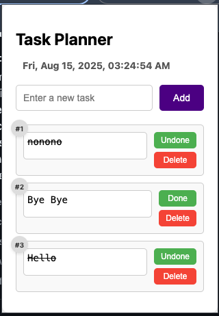

# Chrome Extension - Task Planner

A simple task planner Chrome extension to manage your tasks effectively.

## Features

- Add, edit, and delete tasks.
- Mark tasks as done or undone.
- Displays date and time dynamically.



## Installation

1. Clone this repository:
   ```bash
   git clone https://github.com/<your-username>/chrome-extension-task-planner.git
   ```
2. Open Chrome and navigate to chrome://extensions/.
3. Enable Developer mode (top-right corner).
4. Click Load unpacked and select the project folder.
